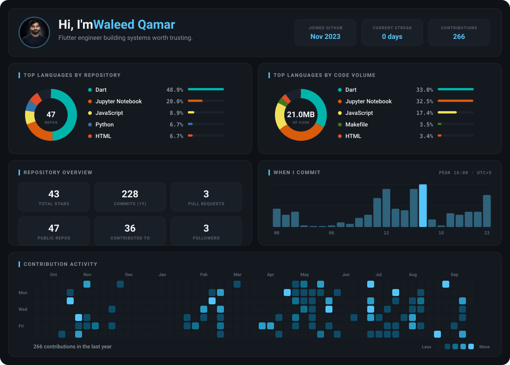

  

  
  
  

---

## About

I design and build software end-to-end — mobile apps, the backends behind them, and the databases underneath that.

I don't build screens. I build systems: problem, architecture, experience, performance, maintainability — in that order.

- Flutter engineer shipping production systems for real clients, not demos
- Comfortable the whole way down: Dart → Postgres triggers and RLS → ESP32 firmware
- Two published Dart/Flutter packages, one app on Google Play
- BSCS at the University of the Punjab, Gujranwala Campus — class of 2027
- Long game: AI research. Everything else is the runway.

 

## Selected Work

| Project | What it is | Stack |
| :--- | :--- | :--- |
| **pretext for Dart/Flutter** | Port of Cheng Lou's `pretext` — pure-arithmetic multiline text layout with per-line widths. Lets text flow around obstacles, which `TextPainter` can't do. | Dart, Flutter |
| **Ledgerly** | Construction business management suite: procurement, invoicing, clients, vendors, daily production sheets, payroll, audit logs. Postgres automation layer with triggers, rollups and RLS. | Flutter, Riverpod, Supabase, PostgreSQL |
| **Biometric Attendance Pipeline** | ZKTeco MB20 → local Python sync agent → Supabase Edge Functions → payroll. Handles offline devices and replayed punches without duplicating records. | Python, Supabase, PostgreSQL |
| **Generator Monitoring (IoT)** | ESP32 firmware with non-blocking flush queue, NTP-validated timestamps and NVS heartbeat crash recovery, streaming to a Flutter dashboard. | C++, ESP32, Firebase, Flutter |
| **Fleet Fuel Management** | Delivered fleet fuel tracking and reconciliation app for a logistics client. | Flutter, Supabase |
| **MindForge** | Published on Google Play. | Flutter |
| **CaseTrack** | Offline-first legal case tracker. Clean architecture, local-first with optional cloud sync. | Flutter, Hive, Firebase |
| **YFCC100M Ablation Study** | Seven-stage pipeline, late-fusion ResNet + metadata MLP. Research write-up in progress. | Python, PyTorch |

 

## Writing

**Android Internals for Flutter Developers** — a long-form technical series on what actually happens beneath the framework: Zygote and cold start, ART and GC pauses, VSYNC and Choreographer, SurfaceFlinger, Binder and platform channels, Doze and process death, Impeller and jank.

Every claim is tiered by evidence and backed by a reproducible sample in a companion repo. Published on [LinkedIn](https://www.linkedin.com/in/me-waleed-qamar/).

 

## Stack

**Core**

  
  
  
  
  
  

**Backend & Data**

  
  
  
  
  

**Embedded & Tooling**

  
  
  
  
  

 

## Activity

  <picture>
    <source media="(prefers-color-scheme: dark)"  srcset="./assets/dashboard-dark.svg" />
    <source media="(prefers-color-scheme: light)" srcset="./assets/dashboard-light.svg" />
    
  </picture>

 

  <picture>
    <source media="(prefers-color-scheme: dark)" srcset="https://raw.githubusercontent.com/waleed-qamar/waleed-qamar/output/snake-dark.svg" />
    <source media="(prefers-color-scheme: light)" srcset="https://raw.githubusercontent.com/waleed-qamar/waleed-qamar/output/snake.svg" />
    
  </picture>

 

---

  Available for interesting problems.

